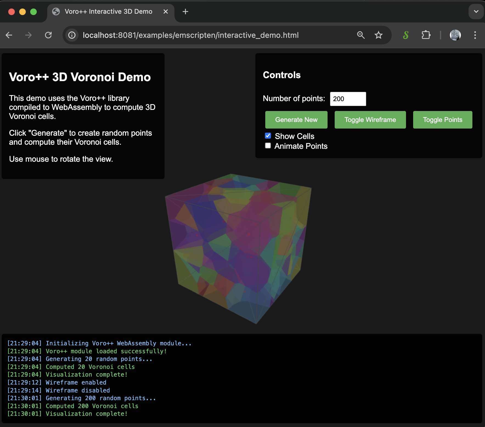
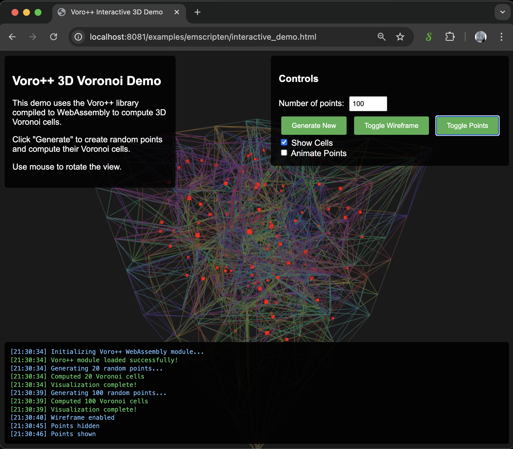

# Voro++ WebAssembly - Interactive 3D Voronoi Visualization

An enhanced fork of Voro++ compiled to WebAssembly with a modern, interactive 3D visualization demo using Three.js.

## 🚀 [Live Demo](https://virtualorganics.github.io/Voro-Emscripten-fork/)

https://virtualorganics.github.io/Voro-Emscripten-fork/

Try the interactive 3D Voronoi visualization demo to see the WebAssembly capabilities in action!

## 📸 Screenshots



*Interactive 3D Voronoi cells with colorful visualization*



*Wireframe view showing the Voronoi cell structure*

## 🎯 What's New in This Fork

This fork significantly improves upon the original Voro++ Emscripten bindings with:

### ✨ Enhanced Features
- **Interactive 3D Visualization**: Beautiful Three.js-based demo with real-time Voronoi cell computation
- **Modern JavaScript API**: Clean ES6 module interface with proper memory management
- **Live Animation**: Watch Voronoi cells update in real-time as points move
- **User-Friendly Controls**: Intuitive interface for adjusting parameters and visualization options
- **Proper WASM Loading**: Fixed module loading issues with correct path resolution
- **Memory Safety**: Proper cleanup of Emscripten vectors to prevent memory leaks

### 🔧 Technical Improvements
- Fixed Emscripten vector binding issues that caused runtime errors
- Corrected Container constructor parameters (9 instead of 13)
- Added proper `convertToWorld` parameter support for correct coordinate systems
- Implemented efficient triangulation for non-planar Voronoi faces
- Added comprehensive error handling and logging

## 📦 What is Voro++?

[Voro++](https://math.lbl.gov/voro++/) is a software library for carrying out three-dimensional computations of the Voronoi tessellation. A Voronoi tessellation is a partitioning of space into regions based on distance to a specific set of points.

This WebAssembly version brings the power of Voro++ to the web browser, enabling:
- 3D Voronoi cell computation directly in the browser
- No server-side processing required
- Fast, efficient calculations using compiled C++ code
- Easy integration with JavaScript applications

## 🛠️ Building from Source

### Prerequisites
- [Emscripten SDK](https://emscripten.org/docs/getting_started/downloads.html)
- Make sure `emcc` is in your PATH

### Build Steps
```bash
# Clone the repository
git clone https://github.com/VirtualOrganics/Voro-Emscripten-fork.git
cd Voro-Emscripten-fork

# Build the WebAssembly module
./build.sh

# The compiled files will be in the bin/ directory:
# - bin/voro_raw.js (JavaScript module)
# - bin/voro_raw.wasm (WebAssembly binary)
```

## 💻 Usage

### Basic Example
```javascript
import voro from './bin/voro_raw.js';

// Initialize the module
const voroModule = await voro({
    locateFile: (filename) => {
        if (filename.endsWith('.wasm')) {
            return '/bin/voro_raw.wasm';
        }
        return filename;
    }
});

// Create a container (box from 0 to 1 in all dimensions)
const container = new voroModule.Container(
    0, 1, 0, 1, 0, 1,  // Box bounds: x_min, x_max, y_min, y_max, z_min, z_max
    1, 1, 1            // Grid divisions: nx, ny, nz
);

// Create points (must use Emscripten vector)
const points = new voroModule.VectorFloat();
points.push_back(0.5); points.push_back(0.5); points.push_back(0.5);  // Point 1
points.push_back(0.2); points.push_back(0.3); points.push_back(0.7);  // Point 2
// ... add more points

// Compute Voronoi cells
const cells = container.computeCells(points, true);  // true = convertToWorld

// Process results
for (let i = 0; i < cells.size(); i++) {
    const cell = cells.get(i);
    console.log(`Cell ${i}: ${cell.vertices.size()} vertices`);
}

// Important: Clean up memory
points.delete();
cells.delete();
container.delete();
```

### API Reference

#### Container Constructor
```javascript
new Container(x_min, x_max, y_min, y_max, z_min, z_max, nx, ny, nz)
```
- `x_min, x_max, y_min, y_max, z_min, z_max`: Bounding box dimensions
- `nx, ny, nz`: Grid divisions for spatial optimization

#### computeCells Method
```javascript
container.computeCells(points, convertToWorld)
```
- `points`: VectorFloat containing x,y,z coordinates (flattened array)
- `convertToWorld`: Boolean to convert coordinates to world space
- Returns: Vector of CellExport objects

#### CellExport Structure
Each cell contains:
- `particleID`: Index of the generating point
- `vertices`: VectorFloat of vertex coordinates (x,y,z flattened)
- `faces`: VectorVectorInt of face vertex indices
- `neighbors`: VectorInt of neighboring cell IDs

### Important Notes

1. **Memory Management**: Always call `.delete()` on Emscripten objects when done
2. **Coordinate System**: Voro++ uses the range [0,1] by default
3. **Vector Usage**: JavaScript arrays must be converted to Emscripten vectors
4. **Face Triangulation**: Voronoi faces may have more than 3 vertices and need triangulation for rendering

## 🤝 Contributing

Contributions are welcome! Please feel free to submit issues or pull requests.

## 📄 License

This project maintains the same license as the original Voro++ library. See the LICENSE file for details.

## 🙏 Acknowledgments

- Original [Voro++ library](https://math.lbl.gov/voro++/) by Chris H. Rycroft
- [Three.js](https://threejs.org/) for 3D visualization
- [Emscripten](https://emscripten.org/) for WebAssembly compilation

## 🔗 Related Projects

- [Original Voro++ Emscripten bindings](https://github.com/delfrrr/voro-emscripten) - The project this fork is based on
- [Voro++ Official Site](https://math.lbl.gov/voro++/) - The original C++ library
